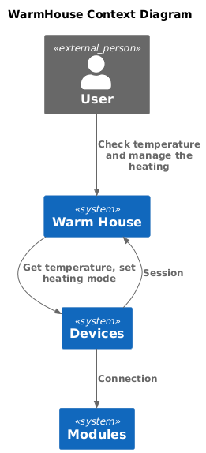
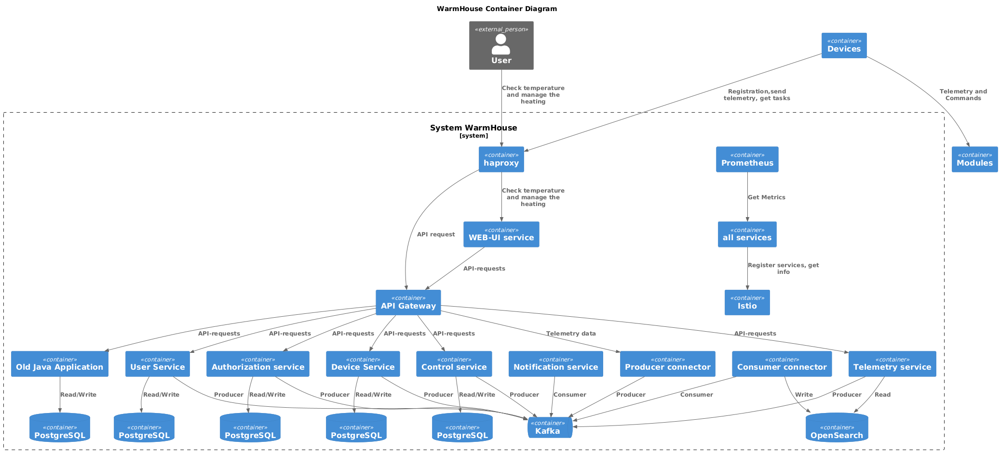
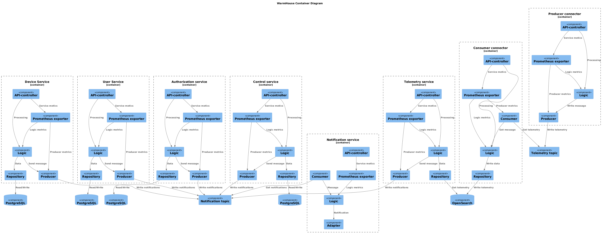

# Задание 1

Особенности и ограничения:
 - Пользователи могут просматривать только текущую температуру, а не исторические данные или прогнозируемые
 - Отсутсвие оповещений, получение данных только через WebUI
 - Устройства должны подключаться к порталу, это поможет избежать проблем с Nat и отсутсвием белых IP
 - Единая СУБД для всех типов данных
 - Запросы любой критичности обрабатываются синхронно
 - Отсутсвует гео-распределение
 - Отсуствует возможность провести A/B тестирование
 - Отсутсвует информация с чем взаимодействет команда по обслуживарию клиентов.
 - Отсуствует информация как устраняются проблемы у клиентов, есть ли администраторы и панель администратора. Вероятнее всего проблемы устраняются через тикеты на разработчиков или DevOps
 - Отсутствует информация о мониторинге проекта
 - Отсутствует информация о наличии контуров тестирования
 - Отсутствует информация о протоколах.
 - Отсутствует инфомрация о механихмах идентификации и аунтетификации.

Проблемы:
 Для текущих бизнес задач единственный недостаток, это выезд специалистов для установки оборудования. Текущая архитектура не позволит реализовать план по развитию бизнеса. Для текущей задачи в которой предоставлены 2 функции, данного решения достаточно. При расширении базы клиентов можно развирнуть еще один экземпляр монолита и балансировать на уровне DNS. В описанных кейсах нагрузка на БД не прослеживается.

# Задание 2

