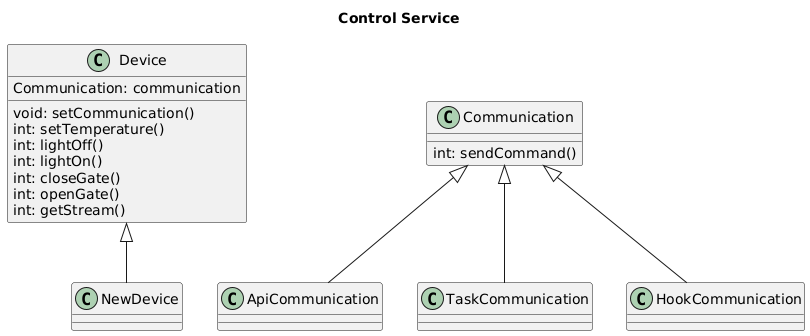

Это шаблон для решения **первой части** проектной работы. Структура этого файла повторяет структуру заданий. Заполняйте его по мере работы над решением.

# Задание 1. Анализ и планирование

Чтобы составить документ с описанием текущей архитектуры приложения, можно часть информации взять из описания компании условия задания. Это нормально.

### 1. Описание функциональности монолитного приложения

**Управление отоплением:**

- Пользователи могут управлять отоплением

**Мониторинг температуры:**

- Пользователи могут проверять температуру

### 2. Анализ архитектуры монолитного приложения

- Язык программирования: Java
- База данных: PostgreSQL
- Архитектура: Монолитная, все компоненты системы (обработка запросов, бизнес-логика, работа с данными) находятся в рамках одного приложения.
- Взаимодействие: Синхронное, запросы обрабатываются последовательно.
- Масштабируемость: Ограничена, так как монолит сложно масштабировать по частям.
- Развёртывание: Требует остановки всего приложения.

Особенности и ограничения:
 - Пользователи могут просматривать только текущую температуру, а не исторические данные или прогнозируемые
 - Отсутсвие оповещений, получение данных только через WebUI
 - Устройства должны подключаться к порталу, это поможет избежать проблем с Nat и отсутсвием белых IP
 - Единая СУБД для всех типов данных
 - Запросы любой критичности обрабатываются синхронно
 - Отсутсвует гео-распределение
 - Отсуствует возможность провести A/B тестирование
 - Отсутсвует информация с чем взаимодействет команда по обслуживарию клиентов.
 - Отсуствует информация как устраняются проблемы у клиентов, есть ли администраторы и панель администратора. Вероятнее всего проблемы устраняются через тикеты на разработчиков или DevOps
 - Отсутствует информация о мониторинге проекта
 - Отсутствует информация о наличии контуров тестирования
 - Отсутствует информация о протоколах.
 - Отсутствует инфомрация о механихмах идентификации и аунтетификации.

### 3. Определение доменов и границы контекстов

- Домен: Управление домом
    - Поддомен: Мониторинг показателей
        - Контекст: Получение показателей температуры
    - Поддомен: Управление устройствами
        - Контекст: Управление отоплением

### **4. Проблемы монолитного решения**

 Для текущих бизнес задач единственный недостаток, это выезд специалистов для установки оборудования. Текущая архитектура не позволит реализовать план по развитию бизнеса. Для текущей задачи в которой предоставлены 2 функции, данного решения достаточно. При расширении базы клиентов можно развирнуть еще один экземпляр монолита и балансировать на уровне DNS. В описанных кейсах нагрузка на БД не прослеживается.

### 5. Визуализация контекста системы — диаграмма С4

# Задание 2. Проектирование микросервисной архитектуры

**Диаграмма контейнеров (Containers)**

**Диаграмма компонентов (Components)**

**Диаграмма кода (Code)**

# Задание 3. Разработка ER-диаграммы

Добавьте сюда ER-диаграмму. Она должна отражать ключевые сущности системы, их атрибуты и тип связей между ними.
